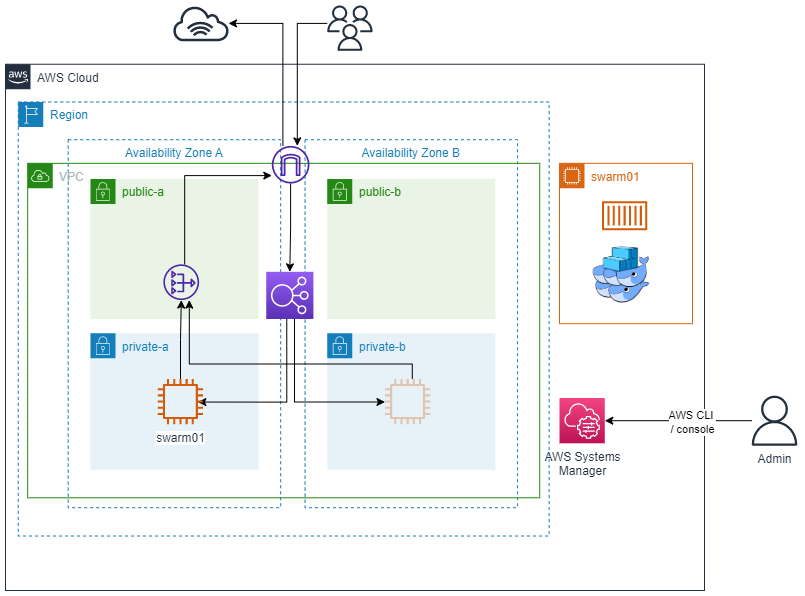

# ec2-swarm

An example of how to use RHEL 8 EC2 instances to run docker swarm. By default, one 
instance is created, though multiple instances can be built by changing the variable
`machine_count`.

*This demonstration uses unencrpyted  HTTP (80) and should not be used in production as-is.*

## Architecture



## Prerequisites

- Assumes the following already exist:
  - VPC with an internet gateway attached.
  - At least one NAT gateway.
  - Two or more public subnets.
  - At least one private subnet.
- An AWS role with sufficient privileges to:
  - Create EC2 instances.
  - IAM to create the SSM instance role.
  - Create load balancers and attaching targets.
  - Start SSM sessions.

## Usage

### Environment variables

| Variable                | Description                            |
|-------------------------|----------------------------------------|
| `AWS_ACCESS_KEY_ID`     | Access Key for AWS.                    |
| `AWS_SECRET_ACCESS_KEY` | Secret Access Key for AWS.             |
| `AWS_SESSION_TOKEN`     | Session token (if using user via SSO). |

### Required inputs

| Variable                | Description         |
|-------------------------|-------------------- |
| `vpc_id`                | ID of VPC to use.   |
| `public_subnet_ids`     | Public subnet IDs.  |
| `private_subnet_ids`    | Private subnet IDs. |

### Optional inputs

| Variable          | Description                        | Default                |
|-------------------|------------------------------------|------------------------|
| `app_prefix`      | Prefix for soultion and EC2 names. | `swarm`                |
| `container`       | Container image to deploy.         | `kennethreitz/httpbin` |
| `container_tag`   | Tag of container to deploy.        | `latest`               |
| `instance_type`   | Instance type to use.              | `t2.micro`             |
| `machine_count`   | Number of EC2 instances to build.  | `1`                    |

## Costs

- Be aware that the load balancer and NAT gateway costs continue even if you shutdown/destroy the 
EC2 instances. 
- Out of the box, this pattern deploys Red Hat Enterprise Linux 8 AMI with a PAYG license. It is highly 
recommended that instances be stopped or destroyed when not in use to avoid the license cost. For production,
a Red Hat subscription can be applied at an AWS account level.

## Using SSM to connect to an instance

All instances can be connected to either via the AWS console of CLI. To use the CLI, do
the following: 
- Install the [Session Manager Plugin](https://docs.aws.amazon.com/systems-manager/latest/userguide/session-manager-working-with-install-plugin.html) for AWS CLI.

- Run the following from the CLI:
```bash
# To get instance IDs
aws ec2 describe-instances --filters Name=instance-state-name,Values=running \
   --query 'Reservations[*].Instances[*].{Instance:InstanceId,Name:Tags[?Key==`Name`]|[0].Value}' \
   --output text --region eu-west-2
# To start session
aws ssm start-session --target $INSTANCE_ID --region eu-west-2
```