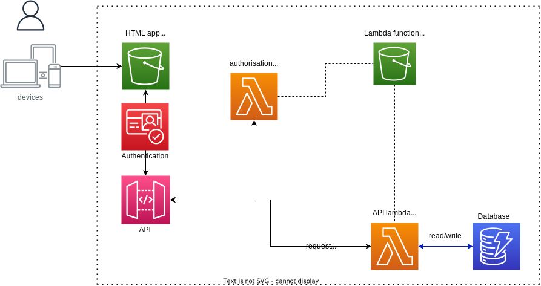

# AWS Serverless Web Example Application

In this example application we want to demonstrate how to host a web app in AWS (Amazon Web Services) and how to manage the cloud components using [Terraform](https://www.terraform.io). 


## Web App Use Case

A common use case for web applications in research is to provide a service that will:
- allow users to create and manipulate data and content
- have the content stored centrally and securely
- provide access to the content via a web-browser

For this reason, we created an example app with the following features:
- users to sign-up/log-in to the web app
- create, read, update and delete images
- view the images they have stored centrally.

## What to do with this example

The purpose of this exercise is to provide a concrete example of how a serverless web app can be built on AWS.
Feel free to use the code as a starting point for your own app.

### Limitations

- are lambda functions the best choice for my application? It is worthwhile reading through the documentation [https://aws.amazon.com/lambda/] . E.g. lambda functions need time to "ramp" up. In short, it may take some time before the function actually executes. In part, this can be mitigated with configuring lambda functions (caches, etc). Or by choosing a different architecture (e.g. EC2 instances)
- Cognito is generally a useful service to handle authorisation and authentication. At UCL many services, however, run a mixed environment, whereby some users are UCL staff members and others are not. Some are researchers (UCL/non-UCL) with access to different functions than others. The configuration of Cognito will therefore be different to the simple example given here. You may also end up using 2 separate authorisation/authentication systems -> one for staff and one for non-UCL members.
- this app is very basic in the following sense:
   - there is no backup facility included. This would be necessary for an application holding user data. 
   - the app is running from a single availability zone. 
   - you might want to consider extra security, e.g. in form of Virtual Private Cloud (VPC) to protect e.g. the database and the S3 buckets
   - logging is not provided (Cloudwatch)
   - in web app development it is common to separate between a "staging" (i.e. in development) and a "production" environment. Only one is given here.

## AWS Infrastructure

The overall AWS infrastructure is shown in the diagram below.



The AWS components used in this example are as follows:
|| Component Name || Function ||
| AWS Cognito | for user sign-in and account creation |
| AWS Lambda | "serverless" functions | 
| AWS API Gateway | defining API functions to interact between web-app client and web service |
| AWS S3 Bucket | S3 (Simple Storage Solution) to hold the web app run in browsers as well as the source code for the lambda functions |
| AWS Dynamodb Database | the database (NoSQL) holding users' data |

### Why this architecture?
The architecture follows the principles of an architecture for micro-services, whereby API functions/endpoints are provided as a layer between client applications and responses/actions on the server side. 

API functions require backend/server-based functionality to interact with other services - in this case a database (DynamoDB).
There are different ways to accomplis this, e.g. providing an EC2 service to host the functions.
Lambda functions (often called "serverless") are an easy and cost-effective alternative. 

User sign-up and sign-in are standard features of web apps these days. However, implementing them from scratch can be time-consuming, particularly if 
common security and safety features (e.g. OAuth 2 paths) are to be included. Cognito is a service provided by AWS that takes most of that pain away. 


## Example Files and Folders

|| Folder Name || Content ||
| aws/lambda-functions | the source code for 5 lambda functions (create, delete, get all, get by ID, update) |
| frontend | the source code for the React web-site |
| terraforn | the scripts for building the AWS infrastructure |

## How does it all hang together?

The ```Terraform``` folder contains 4 terraform scripts 

|| Script Name || What does it do ||
| main.tf | "entry" terraform script that defines the provider, database, Cognito user pool and API Gateway |
| lambdas.tf | resources relating to the 5 lambda functions needed |
| s3buckets.tf | defines the publicly readable S3 bucket for the website and the private S3 bucket for the lambda functions |
| variables.tf | common names/variables used by the other scripts |


